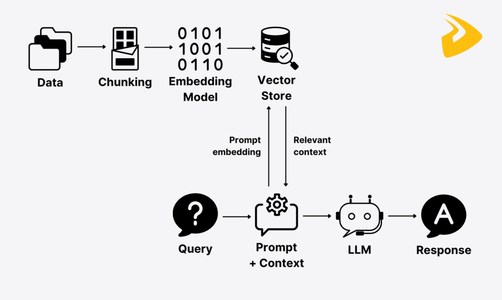
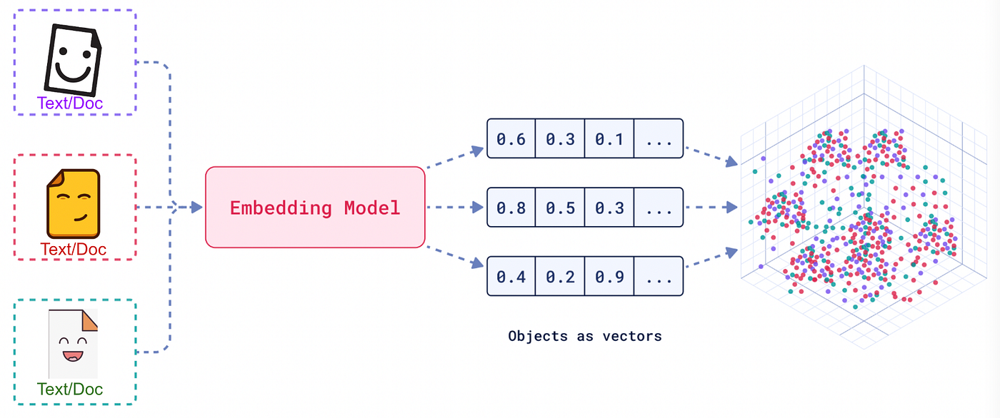

## What is RAG and Why Use It?

Large Language Models (LLMs) are trained on vast datasets, but they possess two major limitations: **knowledge cutoff** (they don't know about data published after their training) and **lack of private context** (they are unaware of your specific data, such as private company documents, proprietary code, or specialized textbooks not in their training set). 

**Retrieval-Augmented Generation (RAG)** addresses these issues by providing the LLM with an intelligent way to access external information based on its semantic meaning. Instead of relying solely on its pre-trained internal weights, the model is supplied with specific, relevant snippets of text retrieved from a trusted source—in our case, Charu C. Aggarwal's *Data Mining: The Textbook*.

### How it works:
1.  **User Query:** The student asks a question.
2.  **Retrieval:** The system searches a database for the most relevant sections of the textbook.
3.  **Augmentation:** The retrieved sections are prepended to the user's question as context.
4.  **Generation:** The LLM generates a response based *only* on the provided context (for theory) while using its general capabilities for practical tasks (like writing Python code).

---

## Embedding Models

As demonstrated in `notebooks/embedding_demo.ipynb`, computers cannot  read text the way humans do. They require numerical representations. 

**Embedding Models** are specialized neural networks that transform unstructured text into dense numerical vectors. These vectors represent **semantic meaning**. In a high-dimensional vector space, sentences like *"Clustering groups similar points"* and *"Partitioning algorithms find data segments"* will be mathematically closer to each other than to a sentence about cats or dogs.

In this project, we support two modes:
- **Local:** Using Ollama (defaulting to `qwen3-embedding:0.6b`), which allows for private, offline processing.
- **Cloud:** Using OpenAI’s `text-embedding-3-small` for higher performance and dimensionality.

### Hybrid Search & Sparse Embeddings
While dense embeddings are great for semantic meaning, they can sometimes miss specific keywords or technical terms (like "BM25" or "Apriori"). To solve this, we implemented **Hybrid Search**.

In addition to dense vectors, we generate **sparse embeddings** using the **BM25 algorithm** (via `FastEmbedSparse`). This represents traditional data mining and information retrieval:
- **Keyword Search (Sparse):** Finds exact matches for specific terms.
- **Semantic Search (Dense):** Finds contextually similar concepts.

By combining these into a single **Hybrid** retrieval mode, we get the best of both worlds: the precision of keyword matching and the depth of semantic understanding.

---

## Implementation Details

### Step 1: Ingestion (`src/ingest/`)
Ingestion is the process of preparing the textbook for retrieval. We implemented two distinct strategies to compare performance:

*   **Simple Ingest (`simple_ingest.py`):** Uses a `RecursiveCharacterTextSplitter` to break the PDF into chunks of a fixed size (2000 characters). This is universal but blind to the book's structure.

*   **Advanced Ingest (`advanced_ingest.py`):** We use a custom `contents.json` (generated with LLM assistance) to map chapter boundaries. 
    *   **Chapter Awareness:** Chunks are created within chapter boundaries, ensuring a chunk doesn't bridge two unrelated topics.
    *   **Metadata Injection:** We explicitly prepend chapter titles and numbers to the text of each chunk. Since the embedding model only sees the text content, this ensures that the semantic vector includes the context of where the information came from.
    *   **Preprocessing:** Optional stemming and stop-word removal (`src/util/stemming.py`) can be applied to reduce noise. This is included to demonstrate how a more traditional data preprocessing technique could be paired with more modern approaches. However, since modern embedding models are trained on text data consisting of full, grammatically correct senteces this doesnt necessarily improve the retrieval performance.

### Step 2: Retrieval (`src/retrieval/`)
Once the book is vectorized and stored in **Qdrant** (our vector database), we need to find the right information. We support three retrieval modes:
*   **Dense (Semantic):** Uses cosine similarity on dense embeddings to find meanings.
*   **Sparse (Keyword):** Uses BM25 scores to find exact word matches.
*   **Hybrid:** Mathematically combines both scores, letting us compare and combine traditional information retrieval with modern LLM based embeddings.

*   **Vector Database:** Qdrant stores both dense and sparse embeddings. When a query comes in, it performs multi-vector searches depending on the selected mode.
*   **Simple Chain (`simple_rag.py`):** In this simple approach we first explicitly fetch similar documents from the database and then inject them into a prompt along with the user question. We make one LLM call with this prompt and expect an answer grounded in the retrieved context. This simple approach is usefull in a Q&A system where we dont want/need to have an interactive conversation with the LLM - we just want it to answer the question using the contents of the database. While simple and cheap this has its limitations.
*   **Agentic Retrieval (`rag_agent.py`):** We use a Tool Calling agent. Instead of a linear search, the LLM is given a tool (`retrieve_book_context`). The LLM *decides* when it needs more information and what search query to use, allowing for more nuanced multi-step reasoning. This approach lets as ask unrelated questions without confusing the LLM while also allowing it to search the database multiple times with different queries to find the most relevant data about the question.

---

## Notebooks

The project includes several interactive notebooks to demonstrate the core concepts and workflows:

*   **`embedding_demo.ipynb` (the theory behind RAG):** In this notebook, we provide a visual and mathematical introduction to vector embeddings.
    *   We demonstrate how models like `qwen3-embedding` group semantically similar sentences (comparing animal facts vs data mining concepts).
    *   We use a 3D interactive plot and PCA (Principal Component Analysis) to visualize how different chapters of the textbook naturally cluster together in high-dimensional space.
*   **`simple_ingest.ipynb` (baseline):** We provide a walkthrough of a standard RAG ingestion pipeline.
    *   We cover loading the PDF, performing basic recursive character splitting, and storing the resulting vectors in a vector database (in our case locally).
    *   We conclude with a basic similarity search to show how retrieval works in practice.
*   **`advanced_ingest.ipynb` (optimized):** We explore how to improve retrieval quality through structure aware processing.
    *   We use the `contents.json` map to ensure chunks never cross chapter boundaries.
    *   We implement metadata injection, where chapter titles are prepended to the text chunks to give the embedding model more context about the information's location.

## UI

The project provides a user friendly Streamlit interface to manage the entire RAG flow, from data processing to interactive tutoring.

### Textbook Processing (Ingest Page)
Before chatting, we use the **Ingest Page** to prepare the textbook. This page allows us to:
*   **Upload the PDF:** We upload the textbook file (found in `data/raw/`) to be processed.
*   **Select Strategy:** We choose between Simple Chunking for a quick baseline or Advanced Chunking for chapter aware ingestion.
*   **Configure Granularity:** We use sliders to fine-tune the Chunk Size and Chunk Overlap, allowing us to balance semantic meaning with information density. The collections that come pre-ingested use the default parameters. You can play with them to see how they impact the quality of retrieved results.
*   **Preprocessing:** We can optionally enable stemming and stop-word removal to experiment with traditional text normalization.
*   **Named Collections:** We assign a unique name to the collection, enabling us to store and compare different versions of the database (comparing different chunk sizes or embedding models).

### Chat Interface
The main **Chat Page** is where the tutoring happens. 
*   **Sidebar Settings:** 
    *   **Data Source:** We select which Qdrant collection (ingest method) to use for the session.
    *   **Search Type:** We choose between **Hybrid** (Keyword + Semantic), **Dense** (Semantic Only), or **Sparse** (Keyword Only) search to optimize retrieval for different types of questions.
    *   **Reasoning Engine:** We choose between Simple RAG (always retrieves context) and Agentic RAG (the model decides when to search the book).
    *   **Context Management:** We can toggle chat history to manage the LLM's context window (the LLM can remember and reference previous messages).
    *   **Retrieval Tuning:** We control the number of chunks (**k**) retrieved for each query to optimize the balance between detail and clarity.
*   **Main Chat:** A standard interactive chat interface where we ask questions about data mining and the contents of the course literature.
*   **Retrieved Chunks:** We display the exact snippets of text the system found in the book. This includes a relevance score and the specific source metadata, allowing us to verify the LLM's answers against the original text and see chunks generated during the ingest phase.

